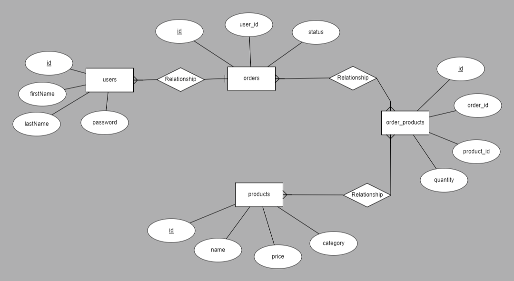

## RESTful API endPoints:
### 1. Main Entry Point
* **(GET)** `http://localhost:3000/`
### 2. Users
* creating new user: **(POST)** `http://localhost:3000/users`
* Authenticate (SignIn): **(POST)** `http://localhost:3000/users/authenticate`
* List (index) all users: **(GET)** `http://localhost:3000/users`
  - *requires Authorization Token*
* Show specific user: **(GET)** `http://localhost:3000/users/:id`
  - *requires Authorization Token*
### 3. Products
* creating new product: **(POST)** `http://localhost:3000/products`
  - *requires Authorization Token*
* List (index) all products: **(GET)** `http://localhost:3000/products`
* Show specific product: **(GET)** `http://localhost:3000/products/:id`
* List products which have a specified Category: **(GET)** `http://localhost:3000/products/category/:category_name`
* Top 5 products: **(GET)** `http://localhost:3000/topFive/products`
### 4. Orders
* creating new order: **(POST)** `http://localhost:3000/orders`
  - *requires Authorization Token*
* List (index) all orders: **(GET)** `http://localhost:3000/orders`
* Update order: **(PUT)** `http://localhost:3000/orders/:id`
  - *requires Authorization Token*
* Add a product to an order: **(POST)** `http://localhost:3000/orders/:id/products`
  - *requires Authorization Token*
  - *Uses `verifyOrderIsActive` Middleware which confirms that selected order is not "complete" (i.e: order.status=active)*
* List all User's orders: **(GET)** `http://localhost:3000/users/:user_id/orders`
  - *requires Authorization Token*
* Completed orders of a user: **(GET)** `http://localhost:3000/complete-orders/:user_id`
  - *requires Authorization Token*
---
## Database Schema:

### 1. Users
  * id [SERIAL PRIMARY KEY]
  * first_name [VARCHAR(100) NOT NULL]
  * last_name [VARCHAR(50)]
  * password [VARCHAR(255) NOT NULL]
### 2. Products
  * id [SERIAL PRIMARY KEY]
  * name [VARCHAR(100) NOT NULL]
  * price [FLOAT(2) NOT NULL]
  * category [VARCHAR(50) NULL]
### 3. Orders
  * id [SERIAL PRIMARY KEY]
  * user_id [INTEGER NOT NULL REFERENCES users(id) ON DELETE CASCADE]
  * status [VARCHAR(30) NOT NULL NOT NULL]
### 4. Order_products
  * id [SERIAL PRIMARY KEY]
  * order_id [INTEGER NOT NULL REFERENCES orders(id) ON DELETE CASCADE]
  * product_id [INTEGER NOT NULL REFERENCES products(id) ON DELETE CASCADE]
  * quantity [INTEGER NOT NULL]
